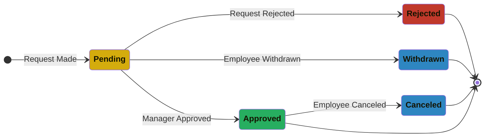
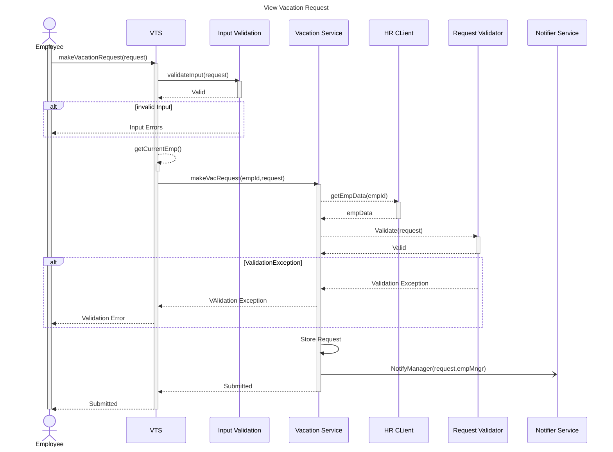
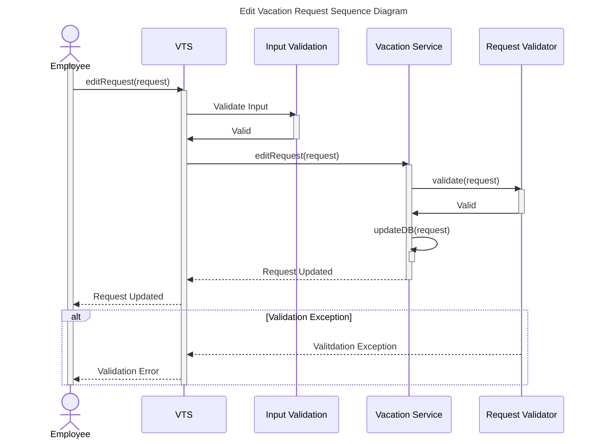
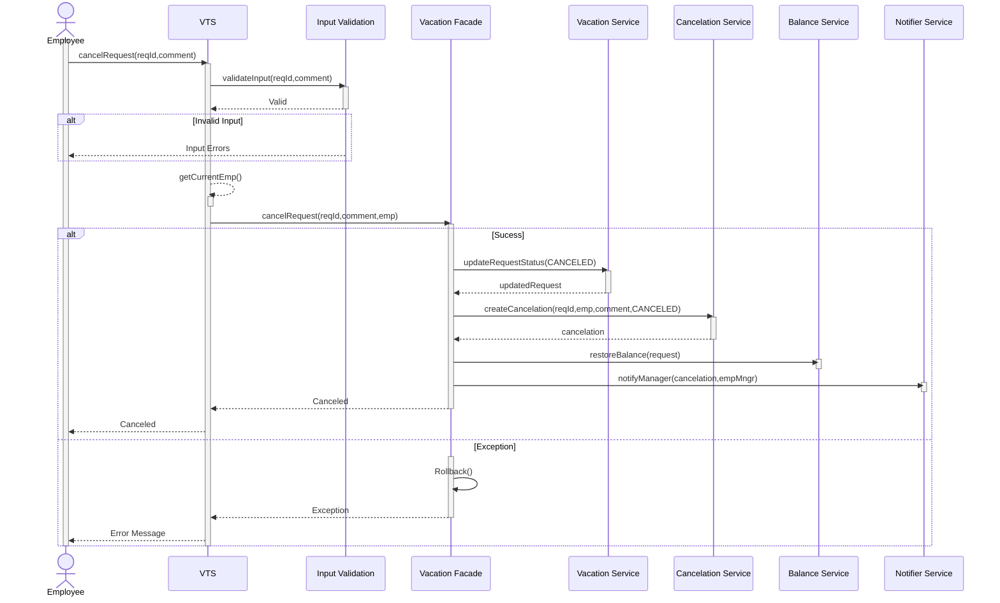
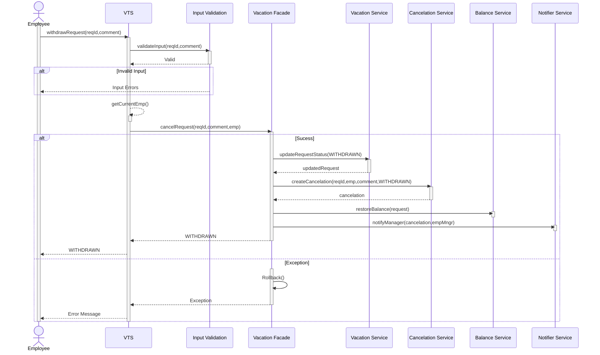

# VTS (Design & Analysis)

## Index

- [**Vision**](#vision)
- [**Domain**](#domain)
- [**Actors**](#actors)
- [**Use Cases**](#use-cases)
- [**State Machine Diagrams**](#state-machine-diagrams)
  - [Vacation Request State](#vacation-request-state)
- [**Flowcharts**](#flowcharts)
- [**Requirements**](#requirements)
  - [Function Requirements](#function-requirements)
  - [Non-Function Requirements](#non-function-requirements)
  - [Constraints ](#constraints)
  - [Assumptions](#assumptions)
- [**Sequence Diagrams**](#sequence-diagrams)
  - [Authentication](#authentication-seq-diagram)
  - [Identifying User Identity and Role](#identifying-user-identity-and-role)
  - [View Vacation Requests](#view-vacation-requests)
  - [Make Vacation Request](#make-vacation-request)
  - [Edit Vacation Request](#edit-vacation-request)
  - [Cancel Vacation Request](#cacncel-vacation-request)
- [**Entities & Data Model**](#entities)
- [**Pseudocode**](#pseudocode)

## Vision

The **Vacation Tracking System (VTS)** aims to manage the process of requesting vacations, managing the status of vacation requests, and handling approvals. The system also enforces necessary restrictions on new requests, ensuring compliance with company policies and enhancing efficiency in vacation management removing the complexity and delays of the manual process.

## Domain

The Domain is centered around managment of employee vacation time.
As the problem revolves around the **complexity and inefficiencies** in the manual process of managing employee vacations. This manual approach creates challenges in ensuring compliance with company policies and employee-specific regulations. Additionally, coordinating vacation approvals without disrupting the business flow is difficult, as manual tracking can lead to workforce shortages in critical locations or positions. These issues can result in delays, miscommunication, and operational inefficiencies.

## Actors & Use cases

<p align=center>

</p>

#### Actors

1. **Employee**: Makes and manages vacation time requests.
2. **Manager**: Approves requests and award time.
3. **HR Clerk**: Manages Employee info & compliance to company policies.
4. **System Admin**: Backup System logs.

#### Use Cases

1. **Manage Time:** create, view , edit , withdraw or cancel vacation time requests.
2. **Approve Requests:** Approves employees' pending requests.
3. **Award Time:** Grants vacation time to employees.
4. **Edit Employee Record:** Managing and updating employees' information.
5. **Manage Location: Manage:** and update work locations and their restrictions.
6. **Manage Leave Categories:** Manage and update vacation categories and restrictions.
7. **Override Leave Records:** Changes any approved requests state.
8. **Back up System Logs**

### State Machine Diagrams

#### Vacation Request State Diagram



- **Pending** state represents a new request pending for further action on it
- **Approved** state represents a request the has been approved either by a manager or the system
- **Rejected** state represents a request the has been rejected by a manager
- **Withdrawn** state represents a request the has been withdrawn by its owner(employee) before being in the state of approved
- **Canceled** state represents a request the has been canceled by its owner(employee) after being approved

### Flowcharts

- **Use case:** Manage Time

  - **Actor:** Employee

    - **Make Request (Main Flow):**
    <p align=center>
    
    </p>

    - **Withdraw Request (Alt Flow):**
    <p align=center>
    
    </p>

    - **Cancel Request (Alt Flow):**
    <p align=center>
    
    </p>

    - **Edit Request (Alt Flow):**
    <p align=center>
    
    </p>

## Requirements

### Function Requirements

1. **Common Functions**
   1. Login through SSO
   2. Role Based Control
2. **Manage Time**
   _employee:_
   1. Views his vacation requests
   2. Makes new vacation requests
   3. Withdraws pending requests
   4. Gets notified on manager approval
   5. Cancel approved requests
   6. Edit pending requests
3. **Approve Requests**
   _manager:_
   1. Gets email notification on subordinates' requests
   2. approve/disapprove subordinates' requests
4. **Award Time**
   _manager can:_

   1. grant vacation time to employee

   **_other function requirements will be added later._**

   ***

### Non Function Requirements

1. **security:** system ensures both authentication and authorization of clients
2. **reliability:** system has high availability and expected functionality
3. **usability:** system is user-friendly and doesn't need having a programmatic background
   ***

### Constraints

1. integration with company's existing systems as HR system.
2. single-sign-on
3. user experience
   ***

### Assumptions

1. HR System provides an API to integrate with.
2. HR System provides the following data through its API:
   - Employee(id,name,location,manager,empType)

## Sequence Diagrams

### Common

#### Authentication Seq Diagram

> the diagram illustrates the sequence of Authenticating a VTS visitor through the main protal using the SSO approach.

1.  User inputs his credentials
2.  Portal Verifies the user credentials through the auth server
3.  Auth Server verfies a visitor is an authorized user and provides an access token
4.  Portal redirects user to VTS and includes the token
5.  VTS uses the access token to verify that the user is authenticated
6.  VTS Returns Home page to user or redirects him to portal login

    ```mermaid
    sequenceDiagram

    title Authentication Sequence Diagram

    Actor User
    participant Portal
    participant VTS
    participant Auth Server

    activate User
    User->>Portal:Login
    activate Portal
    Portal->>Auth Server:Request Authentication
    activate Auth Server
    Auth Server-->>Portal:Access Token(Authenticated)
    deactivate Auth Server

    Portal-->>User:Systems links & token
    User->>Portal:Chooses VTS
    Portal->>VTS:Redirect to VTS & Includes the token
    activate VTS
    deactivate Portal
    VTS->>Auth Server:Verify token
    activate Auth Server
    Auth Server-->>VTS:Authenticated (ok)| UnAuthorized
    deactivate Auth Server
    alt Authenticated
    VTS-->>VTS:Generate HTML
    activate VTS
    deactivate VTS
    VTS -->> User:HTML(ex:VTS HOME PAGE)
    else UnAuthorized

    VTS-->>User: Redirect to portal(Login)
    Deactivate VTS
    end
    Deactivate User
    ```

#### Identifying User Identity and Role

This Sequence illustrates the process of identifying user identity and role using the given access token

> The Role based control approach will depend on Employee ID when granting roles to a user

> Security Context will hold user's Roles

> A need of call to the HR Legacy system depends on the data existing in the access token (username or empId)

> Other System Components may depend on these roles to determine actions required or privileges ex: Since a manager is also an employee system will retrieve his requests and based on his role as a manager will retrieve his sub-ordinates pending requests


---

### Manage Time Use-Case

#### View Vacation Requests

- Also Check these diagrams :
  - [Authentication](#authentication-seq-diagram)
  - [Identifying User Identity and Role](#identifying-user-identity-and-role)


#### Make Vacation Request

- Also Check these diagrams :
  - [Authentication](#authentication-seq-diagram)
  - [Identifying User Identity and Role](#identifying-user-identity-and-role)



#### Edit Vacation Request

- Also Check these diagrams :
  - [Authentication](#authentication-seq-diagram)
  - [Identifying User Identity and Role](#identifying-user-identity-and-role)



#### Cacncel Vacation Request

- Also Check these diagrams :
  - [Authentication](#authentication-seq-diagram)
  - [Identifying User Identity and Role](#identifying-user-identity-and-role)



#### Withdraw Vacation Request

- Also Check these diagrams :
  - [Authentication](#authentication-seq-diagram)
  - [Identifying User Identity and Role](#identifying-user-identity-and-role)



## Entities

- Transient:

  > As the hr system will be the owner of various entities, reducing redundancy and ensuring consistency some entities will be trasient and only its id (in the hr system) will be referenced in our database, we may store some other data if needed.

  - **EmployeeDTO**: DTO object that represents Employee data retieved from HR external API.
  - **Location DTO**: DTO object that represents Location data retrieved from HR external API.

- Persistent:

  - **Role**: Entity Representing a Role in the system
  - **Vacation Request**: Represents entity object representing vacation request details
  - **Vacation Type**: Entity representing category of a vacation request
  - **Employee Balance**: Entity representing employee's vacation balance for a specific Vacation Type
  - **Decision**: Entity representing the decision ( Approval, Refusal ) for a Vacation Request
  - **Cancellation**: Entity representing the cancellation of a Submitted Vacation Request

- Enums
  - **Vacation Status (Enum)**: Enum representing Vacation Request status \
    ( PENDING | APPROVED | REJECTED | WITHDRAWN | CANCELED )
  - **Cancellation Type**: Enum representing Vacation Request cancellation type \
    ( CANCELED | WITHDRAWN )

<figure align="center">
<kbd>
  <h3>ERD</h3>
  <p align = "center">
 
 </p>
 </kbd>
</figure>

## Pseudocode

**Manage Time**:

- **View Vacation Requests:**

  ```pseudoocode
  FUNCTION getVacationRequests()

     // Check if the user is authenticated
     IF security.isAuthenticated() = FALSE THEN
        RETURN Error "Not Authenticated!"
     END IF

     // Get the current user from the security context
     user = security.getCurrentUser()

     // Retrieve employee data for the current user from the HR API
     emp = hr.getEmployee(user.username)

     // Specify a time period for retrieving requests (from 6 months ago to 18 months ahead)
     fromDate = Date.now() - 6Months
     toDate = Date.now() + 18Months

     // Fetch vacation requests for the employee within the specified time period
     requestList = database.getVacationRequests(emp.id, fromDate, toDate)

     RETURN requestList
  END FUNCTION
  ```

- **Make Vacation Request:**

  ```pseudocode
  FUNCTION makeVacationRequest(fromDateTime, toDateTime, vacationType, description)
     // Check if the user is authenticated
     IF NOT security.isAuthenticated() THEN
        RETURN "Error: Not Authenticated!"
     END IF

     // Check if the input is valid
     IF NOT isValidInput(fromDateTime, toDateTime, vacationType, description) THEN
        RETURN "Error: Invalid Input"
     END IF

     // Retrieve employee data for the current user from the HR API
     emp = hr.getEmployee(user.username)
     // Retrieve employee's vacation balance from the database
      balance = database.getVacationBalance(emp.id, vacationType,Year.now())
     request = createRequest(emp,createdNow(),toDateTime,fromDateTime,vacationType,description,balance.id)

     // Retrieve location and other restrictions from the database
     locationRestrictions[] = database.getLocationRestrictions(request)

     balanceRestriction = createBalanceRestriction(balance)
     restrictionsList[] = locationRestrictions + balanceRestriction  // Combining to one list

     // Loop through each restriction and validate the vacation request
     FOR restriction IN restrictionsList
        IF NOT restriction.validate(request) THEN
              RETURN "Validation Error!"
        END IF
     END FOR

     // If all checks pass, store the vacation request as pending
     request.setStatus(PENDING)
     database.storeVacationRequest(request)
     Notify(manager);

     RETURN "Vacation Request Submitted"
  END FUNCTION
  ```

- **Edit Vacation Request**

  ```pseudocode
  FUNCTION editVacationRequest(requestId,fromDateTime,toDateTime,description)
    // Check if the user is authenticated
     IF NOT security.isAuthenticated() THEN
        RETURN "Error: Not Authenticated!"
     END IF

     // Check if the input is valid
     IF NOT isValidInput(fromDateTime, toDateTime description) THEN
        RETURN "Error: Invalid Input"
     END IF

     //Retrieve request from database
      request = database.getVacationRequest(requuestId)

     // Replace old values
      request.setNewValues(fromDateTime,toDateTime,description)

     // Retrieve location and other restrictions from the database
     locationRestrictions[] = database.getLocationRestrictions(request)

     // Retrieve employee's vacation balance from the database
     balance = database.getVacationBalance(emp.id, vacationType)

     balanceRestriction = createBalanceRestriction(balance)
     restrictionsList[] = locationRestrictions + balanceRestriction  // Combining to one list

     // Loop through each restriction and validate the vacation request
     FOR restriction IN restrictionsList
        IF NOT restriction.validate(request) THEN
              RETURN "Validation Error!"
        END IF
     END FOR

     //update database record
     database.updateRequest(request)

    RETURN "Request Updated"
   END FUNCTION
  ```

- **Cancel Vacation Request**

  ```pseudocode
  FUNCTION cancelVacationRequest(requestId,comment)
     // Check if the user is authenticated
     IF NOT security.isAuthenticated() THEN
        RETURN "Error: Not Authenticated!"
     END IF

     // Check if the input is valid
     IF NOT isValidInput(requestId, comment) THEN
        RETURN "Error: Invalid Input"
     END IF

     // Get the authenticated user
     user = security.getCurrentUser()

     // fetch emp data from HR API
     emp = hrClient.getEmp(user.username)

     // Retrieve Decision
     decision = database.getDecision(requestId)

     // Check that if cancelation conditions are met
     IF (NOT decision.isApproved()) OR (decision.createdAt > (Date.now() - 5 Days)) THEN
        RETURN ERROR: "Illegal State"
     End IF

     //Retrieve request from database
     request = database.getVacationRequest(requestId)

     // Check if the user is authorized to change this request
     IF NOT (request.empId = emp.empId or hasRole(HR)) Then
        RETURN Error:"UnAuthorized"
     END IF

     // update request status to canceled
     request.setStatus(CANCELED)
     database.update(request)

     //Create cancelation record
     cancelation= database.insertCancelation(emp.empId,emp.name,requestId,comment,CANCELED)

     // Retrieve employee's vacation balance from the database
     balance = database.getVacationBalance(request.balance_id)

     // Restore balance
     restoreBalance(balance,request)

     //Notify manager
     notifyManager(cancelation,emp.mngr)

     RETURN "Request Canceled"
  END FUNCTION
  ```

- **Withdraw Vacation Request**

  ```pseudocode
  FUNCTION withdrawVacationRequest(requestId)
     // Check if the user is authenticated
     IF NOT security.isAuthenticated() THEN
        RETURN "Error: Not Authenticated!"
     END IF

     // Check if the input is valid
     IF NOT isValidInput(requestId) THEN
        RETURN "Error: Invalid Input"
     END IF

     // Get the authenticated user
     user = security.getCurrentUser()

     //Fetch emp data from HR API
     emp = hrClient.getEmp(user.username)

     // Ensure that there is no decision on the request yet
     IF database.decisionExists(requestId) THEN
        RETURN ERROR: "Illegal State"
     End IF

     //Retrieve request from database
     request = database.getVacationRequest(requestId)

     // Check if the user is authorized to change this request
     IF NOT (request.empId = emp.empId or hasRole(HR)) Then
        RETURN Error:"UnAuthorized"
     END IF

     // update request status to canceled
     request.setStatus(WITHDRAWN)
     database.update(request)

     //Create cancelation record
     cancelation= database.insertCancelation(emp.empId,emp.name,requestId,WITHDRAWN)

     // Retrieve employee's vacation balance from the database
     balance = database.getVacationBalance(request.balance_id)

     // Restore balance
     restoreBalance(balance,request)

     //Notify manager
     notifyManager(cancelation,emp.mngr)

     RETURN "Request Withdrawn"
  END FUNCTION
  ```
