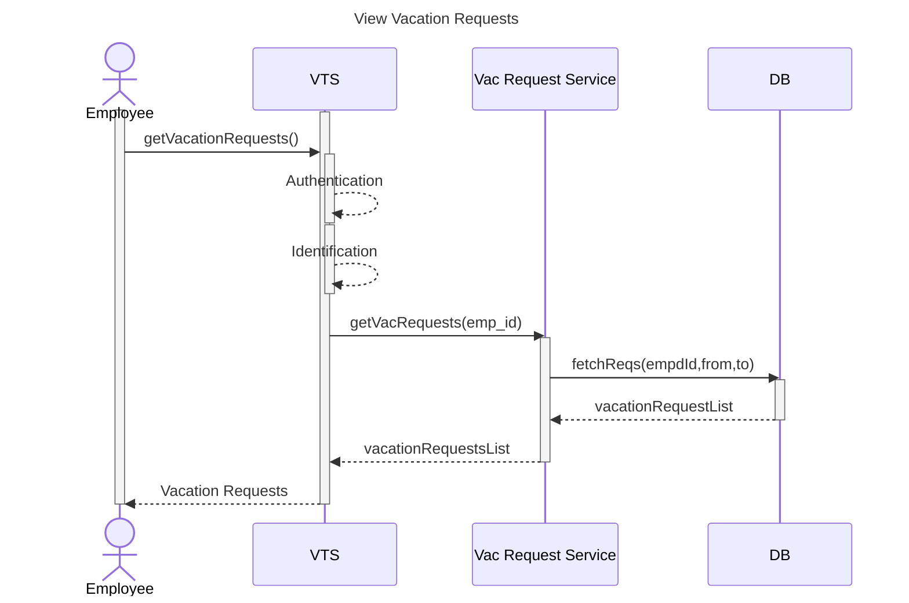
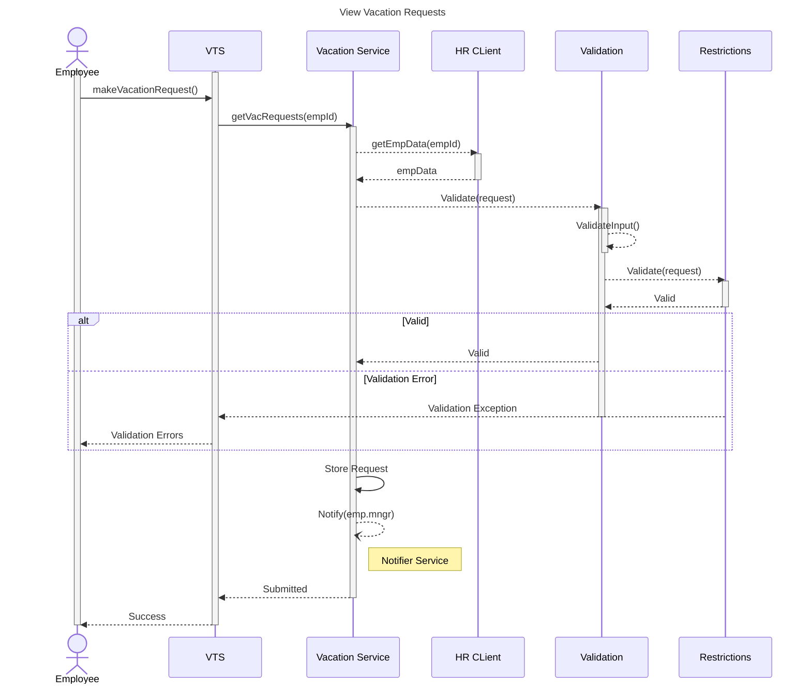

# VTS (Design & Analysis)

## Index

- [**Vision**](#vision)
- [**Domain**](#domain)
- [**Actors**](#actors)
- [**Use Cases**](#use-cases) 
- [**Flowcharts**](#flowcharts)
- [**Requirements**](#requirements)
    - [Function Requirements](#function-requirements)
    - [Non-Function Requirements](#non-function-requirements)
    - [Constraints ](#constraints)
    - [Assumptions](#assumptions)
- [**Sequence Diagrams**](#sequence-diagrams)
   - [Authentication](#authentication-seq-diagram)
   - [Identifying User Identity and Role](#identifying-user-identity-and-role)
   - [View Vacation Requests](#view-vacation-requests)
   - [Make Vacation Request](#make-vacation-requests)
 - [**Entities & Data Model**](#entities)

##  Vision
The **Vacation Tracking System (VTS)** aims to manage the process of requesting vacations, managing the status of vacation requests, and handling approvals. The system also enforces necessary restrictions on new requests, ensuring compliance with company policies and enhancing efficiency in vacation management removing the complexity and delays of the manual process.

## Domain
The Domain is centered around managment of employee vacation time.
As the problem revolves around the **complexity and inefficiencies** in the manual process of managing employee vacations. This manual approach creates challenges in ensuring compliance with company policies and employee-specific regulations. Additionally, coordinating vacation approvals without disrupting the business flow is difficult, as manual tracking can lead to workforce shortages in critical locations or positions. These issues can result in delays, miscommunication, and operational inefficiencies.

## Actors & Use cases
<p align=center>

</p> 

#### Actors
1. **Employee**: Makes and manages vacation time requests.    
2. **Manager**: Approves requests and award time.
3. **HR Clerk**: Manages Employee info & compliance to company policies.
4. **System Admin**: Backup System logs.

#### Use Cases
1. **Manage Time:** create, view , edit , withdraw or cancel vacation time requests. 
2. **Approve Requests:** Approves employees' pending requests. 
3. **Award Time:** Grants vacation time to employees.
4. **Edit Employee Record:** Managing and updating employees' information.
5. **Manage Location: Manage:** and update work locations and their restrictions.
6. **Manage Leave Categories:** Manage and update vacation categories and restrictions.
7. **Override Leave Records:** Changes any approved requests state.
8. **Back up System Logs**  

### Flowcharts

- **Use case:** Manage Time 
   - **Actor:** Employee
      - **Make Request (Main Flow):**
      <p align=center>
      
      </p>

      - **Withdraw Request (Alt Flow):**
      <p align=center>
      
      </p>

   - **Cancel Request (Alt Flow):**
      <p align=center>
      
      </p>

## Requirements

### Function Requirements 
1. **Common Functions**
    1. Login through SSO
    2. Role Based Control
3. **Manage Time**
	*employee:*
    1. Views his vacation requests
    2. Makes new vacation requests
    3. Withdraws pending requests
    4. Gets notified on manager approval
    5. Cancel approved requests 
 3. **Approve Requests** 
   *manager:*
    1. Gets email notification on subordinates' requests
    2. approve/disapprove subordinates' requests
  4. **Award Time**
	*manager can:*
       1. grant vacation time to employee 

     ***other function requirements will be added later.***
     ___ 
   ### Non Function Requirements 
1. **security:** system ensures both authentication and authorization of clients  
2. **reliability:** system has high availability and expected functionality
3. **usability:** system is user-friendly and doesn't need having a programmatic background 
   ___
### Constraints
1. integration with company's existing systems as HR system.
2. single-sign-on
3. user experience
    ___
### Assumptions
1. HR System provides an API to integrate with.
2. HR System provides the following data through its API:
   - Employee(id,name,location,manager,empType)

## Sequence Diagrams
### Common
   #### Authentication Seq Diagram 

   > the diagram illustrates the sequence of Authenticating a VTS visitor through the main protal using the SSO approach.

   1. User inputs his credentials
   2. Portal Verifies the user credentials through the auth server
   3. Auth Server verfies a visitor is an authorized user and provides an access token
   4. Portal redirects user to VTS and includes the token 
   5. VTS uses the access token to verify that the user is authenticated
   6. VTS Returns Home page to user or redirects him to portal login

   

      ```mermaid
      sequenceDiagram

      title Authentication Sequence Diagram

      Actor User
      participant Portal
      participant VTS
      participant Auth Server

      activate User
      User->>Portal:Login
      activate Portal
      Portal->>Auth Server:Request Authentication
      activate Auth Server
      Auth Server-->>Portal:Access Token(Authenticated)
      deactivate Auth Server

      Portal-->>User:Systems links & token
      User->>Portal:Chooses VTS 
      Portal->>VTS:Redirect to VTS & Includes the token
      activate VTS
      deactivate Portal
      VTS->>Auth Server:Verify token
      activate Auth Server
      Auth Server-->>VTS:Authenticated (ok)| UnAuthorized
      deactivate Auth Server
      alt Authenticated
      activate VTS
      VTS->>VTS:Generate HTML
      deactivate VTS
      VTS -->> User:HTML(ex:VTS HOME PAGE)
      else UnAuthorized

      VTS-->>User: Redirect to portal(Login)
      Deactivate VTS
      end
      Deactivate User
      ```

   #### Identifying User Identity and Role

   This Sequence illustrates the process of identifying user identity and role using the given access token 

   >The Role based control approach will depend on Employee ID when granting roles to a user

   >Security Context will hold user's Roles

   >A need of call to the HR Legacy system depends on the data existing in the access token (username or empId)
   
   > Other System Components may depend on these roles to determine actions required or privileges ex: Since a manager is also an employee system will retrieve his requests and based on his role as a manager will retrieve his sub-ordinates pending requests

   ```mermaid
   sequenceDiagram

   title User Identity Sequence Diagram

   Actor User
   participant VTS
   participant VTS Security
   participant HR API Client 
   participant Role Service

   Activate User
   User->>VTS:Access Token
   Activate VTS
   VTS->>VTS Security:Authenticate
   Activate VTS Security
   Activate VTS Security
   VTS Security->>VTS Security:Verify Access Token
   Deactivate VTS Security
   alt Authenticated
   Activate VTS Security
   VTS Security->>VTS Security:Extract Token's username | emp_id
   deactivate VTS Security
   opt Identify Current User
   VTS Security->>HR API Client:getEmpId(username)
   activate HR API Client
   HR API Client-->>VTS Security:empId
   deactivate HR API Client
   end

   VTS Security->>Role Service:getEmpRole(emp_id)
   activate Role Service
   Role Service-->>VTS Security: ROLE_NAME
   Deactivate Role Service
   VTS Security -->> VTS:Authenticated
   Deactivate VTS Security
   VTS-->>User:OK
   Deactivate VTS
   end
   Deactivate User
   ```
   ___

   ### Manage Time Use-Case
   
   #### View Vacation Requests 
   - Also Check these diagrams :
      - [Authentication](#authentication-seq-diagram)
      - [Identifying User Identity and Role](#identifying-user-identity-and-role)


   #### Make Vacation Requests 
   - Also Check these diagrams :
      - [Authentication](#authentication-seq-diagram)
      - [Identifying User Identity and Role](#identifying-user-identity-and-role)



## Entities

1. **EmployeeDTO**: Dto object that represents data retieved from employee external API. 
   > As The HR system will be responsible of managing and storing employee data, the Employee object in our system will be transient 
   
   >only emp id will be referenced in other objects, the rest of attributes will be used for to fulfill the need of various functions across the system
2. **Vacation Request**: Represents entity object representing vacation request details
3. **Vacation Type**: Entity representing category of a vacation request
4. **Employee Balance**: Entity representing employee's vacation balance for a specific Vacation Type
5. **Vacation Status**: (Enum)**:Enum representing Vacation Request status \
(PENDING | APPROVED | WITHDRAWN | CANCELLED)
6. **Role**: Entity Representing a Role in the system
7. **Location**: Entity Representing Work Location of an Employee


<kbd name="sds">
<p align=center>

<figure align=left>
  <h2>ERD</h2>
 
</figure>

